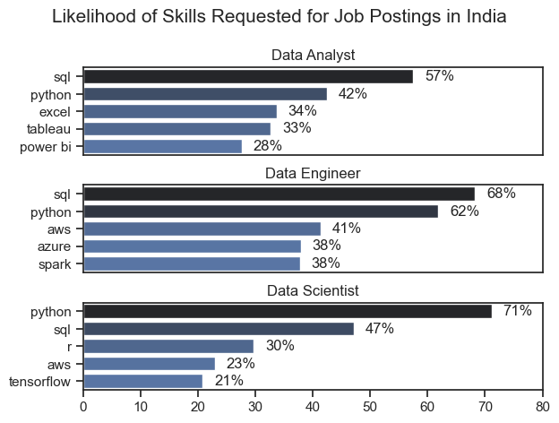
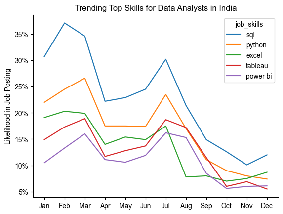
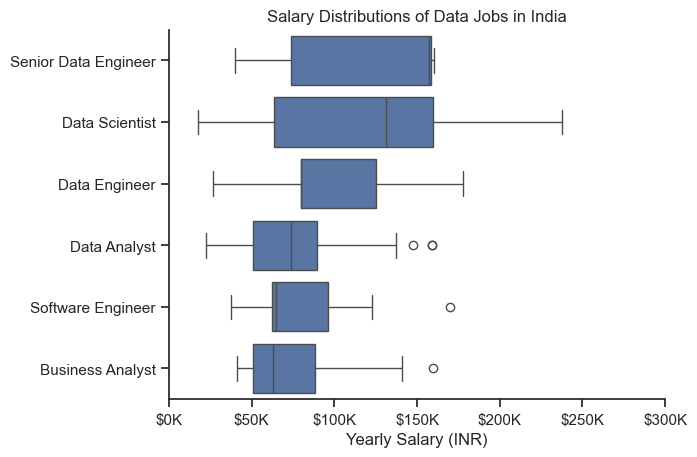
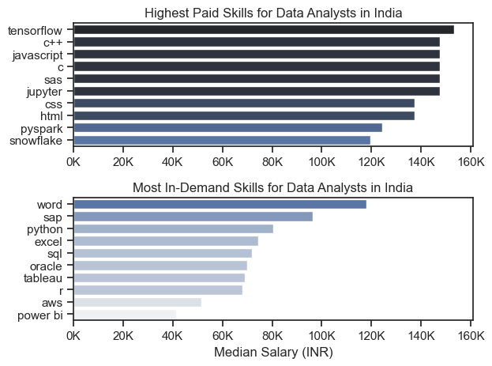

# Overview
This project presents my analysis of the data job market, specifically targeting data analyst roles. It was created out of a desire to navigate and understand the job market more effectively. This project explores the most in-demand and top-paying skills to help identify key trends and opportunities in the field.

The dataset used in this project was sourced from Luke Barousse’s Python Course, providing detailed information on job titles, salaries, locations, and required skills. Using a series of Python scripts, I explore the key questions:

# The Questions
1. What are the skills most in demand for the top 3 most popular data roles?
2. How are in-demand skills trending for Data Analysts?
3. How well do jobs and skills pay for Data Analysts?

# Tools Used in The Analysis
- Python: The core language for all data analysis tasks — from cleaning the dataset to uncovering meaningful insights.

    - Pandas: Used for data manipulation, exploration, and analysis.

    - Matplotlib: Helped in creating clear, customizable data visualizations.

    - Seaborn: Used to design more refined and visually appealing charts for better storytelling through data.

- Jupyter Notebook: Served as my main environment for running code, documenting findings, and combining visuals with explanations.

- Visual Studio Code: Utilized for writing and testing Python scripts efficiently.

- Git & GitHub: Managed version control and shared my work seamlessly, making the entire analysis reproducible and transparent.

# Data Preparation and Cleanup
Before diving into the analysis, I cleaned and organized the data to make sure it was reliable, consistent, and ready for exploration.

## Import and Clean Up Data
I started by setting up the required libraries and loading the dataset, then carried out some initial cleaning to make sure the data was accurate and ready for analysis.

```python
# Importing libraries
import ast
import pandas as pd
import seaborn as sns
import matplotlib.pyplot as plt

# Loading dataset
df = pd.read_csv('C:/Users/Admin/Downloads/job_postings.csv')

# Data Cleanup
df['job_posted_date'] = pd.to_datetime(df['job_posted_date'])
df['job_skills'] = df['job_skills'].apply(lambda x: ast.literal_eval(x) if pd.notna(x) else(x))
```

## Filter Jobs in India
To focus the analysis on the Indian job market, I filtered the dataset to include only roles based in India.

```python
df_IND = df[df['job_country'] == 'India']
```

# The Analysis
## 1. What are the most demanded skills for the top 3 most popular data roles?
To identify the most in-demand skills among the top three data roles, I filtered the dataset to isolate the most popular job titles and extracted their top five associated skills. This analysis highlights which skills are most relevant to focus on, depending on the role of interest.

For detailed view and code: [2_Skill_Demand](Project/2_Skill_Demand.ipynb)

### Results



*Bar graph visualizing the salary for the top 3 data roles and their top 5 skills associated with each.*

### Insights:
- SQL emerges as the most requested skill for both Data Analysts and Data Engineers, appearing in over half of all job postings for these roles. In contrast, Data Scientists show a stronger demand for Python, which features in nearly 71% of job listings.
- Data Engineers and Data Scientists also tend to require more technical skills such as AWS whereas Data Analysts are generally expected to be proficient in data management and visualization tools like Excel and Tableau.
- Across all three roles, Python remains a versatile and highly valued skill — particularly dominant among Data Scientists (71%) and Data Engineers (62%).

## 2. How are in-demand skills trending for Data Analysts?
To analyze how skills have been trending for data analyst roles, I filtered the dataset to include only data analyst positions and grouped the associated skills by the month of the job postings. This helped identify the top five skills each month, revealing how their popularity changed over time.

For detailed view and code: [3_Skills_Trend](Project/3_Skills_Trend.ipynb)

### Results



*Line chart visualizing the trending top skills for data analysts in India.*

### Insights:
- SQL remains the most consistently demanded skill, leading all others across every month. Even with fluctuations, its demand stays well above 20%, peaking above 35% in February.
- Python maintains strong demand from February to August, second only to SQL. It experiences slight dips after September, reflecting a possible seasonal trend in job postings.
- While Excel starts strong early in the year, its demand drops significantly after August. Tableau and Power BI remain relatively stable but lower overall, indicating that while visualization skills are valued, programming and database skills (SQL, Python) carry greater weight in job listings.

## How well do jobs and skills pay for Data Analysts?
To identify the highest-paying roles and skills, I focused on job postings from India and analyzed their median salaries. I first examined the salary distributions of common data roles — Data Scientist, Data Engineer, and Data Analyst — to understand which positions tend to offer the highest compensation.

For detailed view and code: [4_Salary_Analysis](Project/4_Salary_Analysis.ipynb)

### Results

### 1. Salary Distribution of Data Jobs



*Box plot visualizing the salary distributions for the top 6 data job titles.*

### Insights:
- Senior Data Engineers and Data Scientists earn the highest median salaries among all data-related roles, reflecting their advanced skill requirements and responsibilities.
- Data Analysts and Business Analysts have comparatively lower salary ranges, indicating that these roles often serve as entry points into the data field.
- There’s a wider salary spread for Data Scientists and Data Engineers, suggesting significant pay variation depending on experience, company size, and project complexity.

### 2. Highest paid and Most Demanded Skills for Data Analysts



*Two separate bar graphs visualizing the highest paid skills and most in-demand skills for data analysts.*

### Insights:
- The top chart indicates TensorFlow, C++, and JavaScript are among the highest-paying skills, indicating that employers value candidates with strong programming and machine learning expertise.
- The bottom chart highlights that Python, SQL, and Excel dominate the most in-demand skills, showing that foundational data analysis and reporting abilities are essential across most roles.
- There's a clear distinction between the skills that are highest paid and those that are most in-demand. Data analysts aiming to maximize their career potential should consider developing a diverse skill set that includes both high-paying specialized skills and widely demanded foundational skills.

# What I learned?
Throughout this project, I gained a deeper understanding of the data analyst job market in India and strengthened my technical proficiency in Python, particularly in data manipulation and visualization.
- **Advanced Python Skills**: Leveraged libraries such as Pandas for data manipulation and Matplotlib and Seaborn for creating insightful visualizations, enabling efficient and effective analysis.
**Data Cleaning & Preparation**: Recognized the critical role of data cleaning in ensuring reliable insights — reinforcing that data quality directly impacts the accuracy of conclusions.
**Strategic Skill Alignment**: Learned the importance of aligning technical skills with market demand. Understanding how skill relevance, salary trends, and job availability intersect helps guide smarter career decisions in the data field.

# Insights
This project provided several general insights into the data job market for analysts:
- **Skill Demand and Salary Correlation**: There’s a clear link between skill demand and earning potential. Core data skills like SQL, Python, and Excel remain the most sought-after across roles, while proficiency in tools such as Power BI and Tableau also contributes to higher salary opportunities.
- **Market Trends**:  Skill demand varies throughout the year, with SQL and Python maintaining steady relevance. In contrast, visualization tools such as Tableau and Power BI show a gradual decline, indicating a growing industry focus on programming and automation skills.
- **Economic Value of Skills**: Data-centric roles like Data Scientist and Data Engineer offer the highest median salaries in India, driven by specialized technical expertise. Prioritizing high-value, in-demand skills can significantly enhance career prospects and earning potential in the data analytics field.

# Challenges I Faced
This project came with its own set of challenges, each offering valuable learning experiences:
- **Data Inconsistencies**: Managing missing or inconsistent entries demanded careful cleaning and validation to maintain data accuracy and reliability.
- **Complex Visualizations**: Creating clear and meaningful visualizations from large datasets was challenging but essential for effectively communicating insights.
- **Focusing on What Matters**: Learning to identify and concentrate on analyses that provided the most impactful insights helped streamline the project and improve clarity.

# Conclusion
This exploration of the data analyst job market has been both insightful and enriching, revealing the key skills and trends driving this field. The findings not only deepened my understanding but also offer practical guidance for anyone aiming to grow in data analytics. As the industry continues to evolve, continuous learning and regular analysis will be essential to stay ahead. This project serves as a strong foundation for future explorations and emphasizes the value of adaptability in the data-driven world.